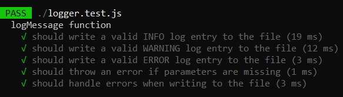

# Dev.Pro Test Assignment

## Task 1: Logger

Context: Your team is working on a project where you need to log various events and errors.
You are asked to create a simple logging function that writes messages to a text file with a timestamp.

Example usage:
```
log_message("application.log", "User logged in", "INFO")
log_message("application.log", "Failed login attempt", "WARNING")
```

Expected Output in application.log:
```
[2023-04-24 12:34:56] [INFO] User logged in
[2023-04-24 12:35:10] [WARNING] Failed login attempt
```

See [logger.js](logger.js) file 

## Task 1.1: Tests

Write tests scenarios for Logger

Scenarios:  

  
See test implementation on [logger.test.js](logger.test.js) file

## Running

- Install all dependencies: `npm i`
- Run all tests: `npm test`
